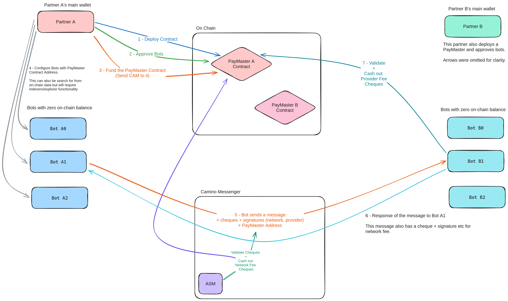

# Camino Bot PayMaster Concept

This is a concept study about implementing a "paymaster" feature for cheque
mechanism of Camino Messenger's bot concept.

## Rationale

Camino Messenger has a concept of "bots" that are used to communicate between
different entitites like providers and distributors. Our initial design was to
use something we call "bot-id" so a company can run multiple bots with the same
wallet (private key).

Companies can also run multiple bots with different wallets. Which in my opinion 
is a better option. But this was not favored because it will bring a burden of managing
funds for multiple bot accounts (wallets).

## Goals 

- To be able to fund multiple bots with the same wallet
- Register bots to the paymaster so bots can use the funds of the paymaster, or
  another payment wallet[^1], without the need for each individual bot wallet to
  have funds.

## Considerations

- Bots will generate cheques for each message they send via the Camino Messenger
- Each message will contain at least one cheque (network fee)
- A message can have multiple cheques. Ex: provider fee that will be paid to the
  service provider
- All of these cheques are **off-chain** and are signed by the bot with its private key
- It should be possible to verify the signature of the cheque **on-chain** and
  release the funds from the paymaster to the receiver of the cheque.

## Notes

- The design is coded in Solidity but the concept is language agnostic.
  Cryptographically, it can be implemented in any language.
- **Security:** The design is not audited for security in any way. For cryptographic security
  we may consider using some standards like EIP-712[^2][^3].
- **PayMaster Address in Cheques:** It may be a good idea to include PayMaster's
  contract address in the cheque, so the cheque is only valid for a specific
  PayMaster.
- **Partner Configuration:** This whole concept can also be implemented directly on core T-Chain
  functionality, inside the Partner Configuration.

## Design

### BotPayMaster

BotPayMaster contract holds the funds. Approves and revokes bots. Provides
functions to validate and cash out cheques.

Below is the workflow about how the whole process will take place. There is also
an technical explanation by GPT-4 for the contract.

#### Partner

- Partners will deploy a BotPayMaster smart contract. 
- And then approve bot addresses using this paymaster contract's `approveBot` function.

#### Bot

- Any approved bot can create cheques, sign them and send them to the receiver.
- Bots create a cheque by creating a hash with `from`, `to`, `amount`, and `nonce`

  ```solidity
  keccak256(abi.encodePacked(from, to, amount, nonce));
  ```

  - **from:** the bot's address
  - **to:** the address of the receiver
  - **amount:** the amount of tokens/coins to send to the reciever
  - **nonce:** incremental nonce to prevent replay of the already cached out cheques

- Then this cheque and signature is send to the receiver.

#### Receiver

- The receiver (or any one that have access to the cheque) can cash out the cheque. 
  - Because the cheques can only be cashed out to the original receiver address,
  it is safe to let any address to initiate the `cashCheque` function. 
  - **TX Fee Account:** This enables one to implement another wallet to be used only to pay gas
    fees.
- In the `cashCheque` function, the PayMaster recreates the cheque hash with the
  given fields of `from`, `to`, `amount` and `nonce`. Then it tries to recover
  the pubkey using the signature. If successfull, it checks if the `from`
  address is same with the recovered one.
- Receiver can use `isChequeValid` function to validate if the cheque is valid, without cashing it out.

## Diagram



## Technical Overview of the BotPayMaster Smart Contract by GPT-4

The `BotPayMaster` contract facilitates secure and verified transactions between bots and their recipients on the Camino Network. Designed with a focus on security and integrity, this contract allows for the approval of bots, management of transaction records, and ensures only authorized transactions are processed.

### Core Data Structures

- **BotTransaction**: A struct capturing details of transactions between a bot and a recipient, including `lastNonce` and `lastAmount` to prevent replay attacks and ensure amount progression.

- **botTransactionsStore**: A nested mapping (`address => mapping(address => BotTransaction)`) storing `BotTransaction` records for each bot-recipient pair, enabling transaction history tracking and validation.

### State Variables

- **approvedBots**: A mapping (`address => bool`) that records the approval status of each bot, dictating whether it's authorized to initiate transactions.

### Events

- **BotApproved**: Emitted when a bot is approved.
- **BotRevoked**: Emitted when a bot's approval is revoked.
- **ChequeCashed**: Emitted upon the successful cashing of a cheque, detailing the transaction.

### Functions

#### approveBot
- **Purpose**: Approves a bot, allowing it to initiate transactions.
- **Modifiers**: `onlyOwner`, ensuring that only the contract owner can approve bots.
- **Effects**: Marks the bot as approved in `approvedBots` and emits `BotApproved`.

#### revokeBot
- **Purpose**: Revokes the approval of a bot, preventing it from initiating future transactions.
- **Modifiers**: `onlyOwner`.
- **Effects**: Marks the bot as not approved in `approvedBots` and emits `BotRevoked`.

#### isBotApproved
- **Purpose**: Checks if a bot is approved.
- **Return**: Boolean value indicating the bot's approval status.

#### getChequeHash
- **Purpose**: Generates a hash of the transaction details for integrity verification.
- **Modifiers**: `pure`.
- **Return**: The keccak256 hash of the encoded transaction details (`from`, `to`, `amount`, `nonce`).

#### recoverSigner
- **Purpose**: Recovers the signer's address from the cheque hash and signature to verify transaction authenticity.
- **Modifiers**: `pure`.
- **Return**: The address of the signer, validated against the provided signature.

#### cashCheque
- **Purpose**: Validates and processes a transaction cheque from a bot to a recipient.
- **Validation**: Checks for bot approval, valid recipient address, nonce progression, and amount progression. Also verifies the signature against the signer's address.
- **Effects**: Updates the transaction record in `botTransactionsStore` and transfers the specified amount to the recipient. Emits `ChequeCashed`.

#### isChequeValid
- **Purpose**: Allows for the validation of a cheque without processing the transaction, useful for verifying transaction details off-chain.
- **Return**: Boolean indicating the validity of the cheque based on approval status, recipient validity, nonce, amount, and signature authenticity.

#### getBotTransaction
- **Purpose**: Retrieves the last transaction details for a specific bot-recipient pair.
- **Return**: The `BotTransaction` record containing the last nonce and amount.

### Summary

`BotPayMaster` is a smart contract designed for managing and validating transactions between approved bots and their recipients. It incorporates cryptographic verification, access control, and transaction history to ensure security and integrity in bot-initiated transactions. The contract enables partners to oversee bot funds, approve bot transactions, and ensure only valid transactions are processed, thereby fostering trust and reliability in bot-mediated transactions on the Camino Network.


[^1]: The smart contract can be improved to be able to spend other wallet's
ERC20-like funds usind the `approve` method of the ERC20 standard.
[^2]: https://eips.ethereum.org/EIPS/eip-712
[^3]: More info on security: https://soliditydeveloper.com/ecrecover